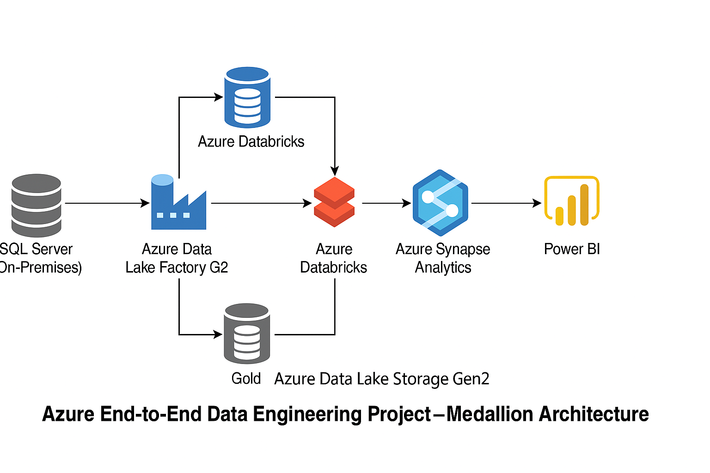

# Retail Customer Metrics Platform (Azure + Databricks + Power BI)

An end-to-end data engineering project to track and visualize customer metrics across a retail chain using Azure services, Databricks, and Power BI.

---

## Architecture




---

## Project Overview

In This project I demonstrated a real-time data pipeline that ingests, transforms, and visualizes customer engagement metrics from multiple retail stores. It uses the Medallion Architecture (Bronze, Silver, Gold) to ensure scalable and clean data layers.

---
## Project Structure.
├── databricks_notebooks/
│   ├── bronze_to_silver.ipynb
│   └── silver_to_gold.ipynb
├── powerbi_reports/
│   └── Customer_Metrics_Report.pbix
├── keyvault_config/
│   └── keyvault_setup.md
├── architecture.png
└── README.md


## 🚀 Technologies Used

| Layer | Tool |
|-------|------|
| Storage | Azure Data Lake Storage Gen2 |
| Ingestion | Azure Data Factory |
| Transformation | Azure Databricks (PySpark) |
| Query & Analysis | Azure Synapse |
| Visualization | Power BI |
| Secrets Management | Azure Key Vault |

---

## 🧪 Pipeline Stages

1. **Bronze Layer**: Raw CSV files ingested from ADLS
2. **Silver Layer**: Cleaned and normalized data using PySpark
3. **Gold Layer**: Aggregated metrics like Customer Count per Company
4. **Synapse**: Final table loaded for BI consumption
5. **Power BI**: Customer dashboard with company-wise metrics

---

## Power BI Report

A Power BI dashboard is built on top of the Gold layer to show:

- Total number of customers per company
- Company-wise distribution
- KPIs with card visuals

## File: `powerbi_reports/Customer_Metrics_Report.pbix`

---

## Security with Azure Key Vault

All credentials are securely stored in **Azure Key Vault** and retrieved via secret scopes in Databricks:

```python
storage_key = dbutils.secrets.get(scope="my-keyvault-scope", key="storage-account-key")


